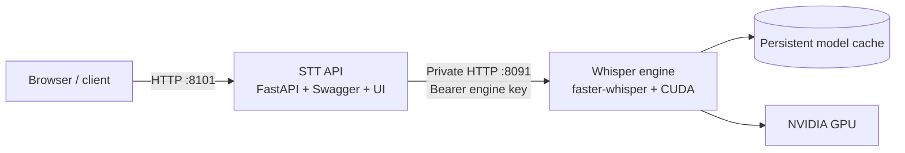
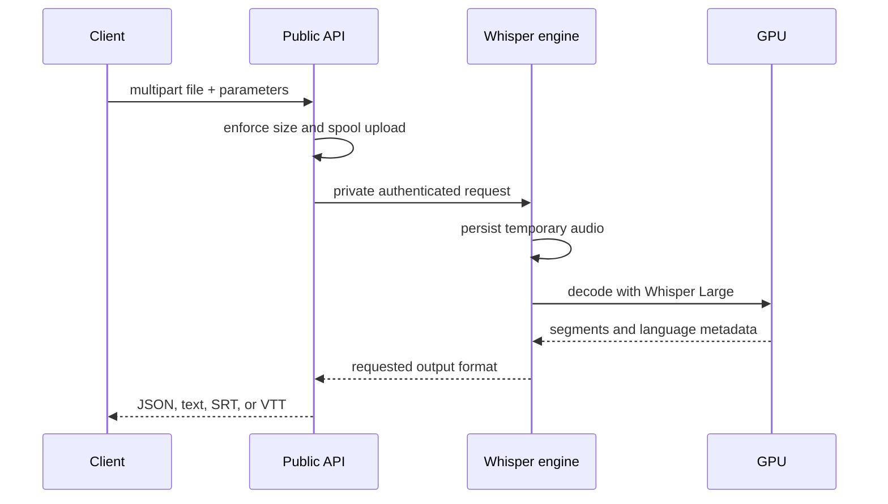

# Architecture

## Goals

The service is designed around four operational goals: a stable GPU process, a small public API surface, an OpenAI-compatible contract, and replaceable inference backends.

## Components

### Public API

`services/api` owns the public HTTP contract, input-size enforcement, Swagger, ReDoc, the Persian upload UI, engine error normalization, and response forwarding. It does not load a model or access the GPU.

### Private engine

`services/engine` loads one Whisper model during application startup. It accepts the OpenAI-compatible transcription request on the private Compose network and serializes GPU work through a bounded semaphore. The default concurrency is one because parallel decoding of a Large model can produce unpredictable VRAM pressure; operators can raise it after measuring their card.

### Model volume

The named `whisper-models` volume stores downloaded Hugging Face artifacts. The first boot can take several minutes. Later container replacements reuse the cache and start much faster.

## Request lifecycle

## Failure boundaries

- If the public API restarts, the loaded GPU model remains resident in the engine.
- If the engine crashes, Docker recreates it with `restart: always` and reloads from the persistent model cache.
- Health checks prevent the API from starting before the model is ready.
- Temporary uploads are deleted after both successful and failed inference.
- Model weights, audio uploads, `.env`, and credentials are excluded from Git.

## Replacing the engine

The public API depends only on two engine endpoints:

- `GET /health`
- `POST /v1/audio/transcriptions`

Any optimized backend—such as whisper.cpp, a native CUDA binary, or a remote inference server—can replace `services/engine` if it preserves this contract. Set `ENGINE_URL` to the replacement and keep the engine network private.
