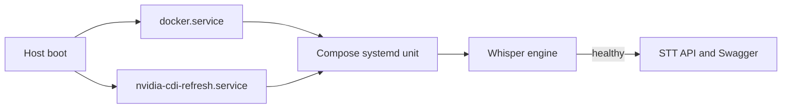

# Production persistence and reboot runbook

This document is the source of truth for keeping the speech-to-text service available across application crashes, Docker restarts, and host reboots. Do not store production passwords, private IP addresses, API keys, or SSH credentials in this repository.

## Production profile

The production stack has two independently supervised containers:

| Compose service | Runtime role | Network exposure | Restart policy |
|---|---|---|---|
| `whisper-engine` | GPU inference engine | private/internal port 8091 | `always` |
| `stt-api` | upload UI, Swagger, and public API | host port 8101 | `always` |

The optimized existing deployment can use different container names—currently `ai-whisper-asr-engine` and `ai-persian-asr-studio`—while preserving the same health and transcription contract.

## Boot dependency chain



Persistence is intentionally implemented at two levels:

1. Docker `restart: always` restores each container after an unexpected process exit or Docker daemon restart.
2. A systemd Compose unit executes `docker compose up -d --remove-orphans` during host boot and restores the declared stack even if containers were previously absent.

The NVIDIA CDI refresh unit must run before Compose so the GPU device exists when the engine container is created.

## One-time host installation

Clone the repository and create the private environment file:

```bash
sudo git clone https://github.com/mohamadkheiry/stt.git /opt/whisper-stt
cd /opt/whisper-stt
sudo cp .env.example .env
sudo chmod 600 .env
```

Generate a strong internal engine key and place it in `.env`:

```bash
openssl rand -hex 32
```

Never commit the resulting `.env` file.

For a standard NVIDIA runtime host:

```bash
sudo docker compose up -d --build
```

For a CDI host:

```bash
sudo docker compose -f compose.yaml -f compose.cdi.yaml up -d --build
```

Install the boot unit:

```bash
sudo cp deploy/systemd/whisper-stt.service /etc/systemd/system/
sudo systemctl daemon-reload
sudo systemctl enable --now docker.service
sudo systemctl enable --now nvidia-cdi-refresh.path
sudo systemctl enable --now whisper-stt.service
```

If the checkout path differs from `/opt/whisper-stt`, update `WorkingDirectory` and all Compose paths in the unit before enabling it.

## Required production invariants

The following conditions must all be true before a release is considered persistent:

```bash
systemctl is-enabled docker.service
systemctl is-enabled nvidia-cdi-refresh.path
systemctl is-enabled whisper-stt.service

systemctl is-active docker.service
systemctl is-active nvidia-cdi-refresh.path
systemctl is-active whisper-stt.service
```

Both containers must report an `always` restart policy:

```bash
docker inspect \
  --format '{{.Name}} policy={{.HostConfig.RestartPolicy.Name}} status={{.State.Status}} health={{.State.Health.Status}}' \
  whisper-stt-whisper-engine-1 whisper-stt-stt-api-1
```

Use `docker compose ps` to resolve actual container names if a different Compose project name is configured.

The model volume must exist and remain outside the writable container layer:

```bash
docker volume ls | grep whisper-models
```

## Safe reboot verification

Schedule host reboot testing during an approved maintenance window because every workload on the server will be interrupted.

Before reboot:

```bash
cd /opt/whisper-stt
sudo docker compose ps
curl -fsS http://127.0.0.1:8101/health
nvidia-smi
sudo systemctl is-enabled whisper-stt.service
```

Reboot only after confirming that unrelated workloads have their own persistence configuration:

```bash
sudo reboot
```

After SSH becomes available again:

```bash
systemctl is-active docker.service nvidia-cdi-refresh.path whisper-stt.service
cd /opt/whisper-stt
sudo docker compose ps
curl -fsS http://127.0.0.1:8101/health
nvidia-smi
```

Finally submit a small known-good Persian audio file:

```bash
curl -fsS \
  -F "file=@smoke-test.wav" \
  -F "language=fa" \
  -F "response_format=json" \
  http://127.0.0.1:8101/v1/audio/transcriptions
```

A successful reboot test requires HTTP 200, non-empty `text`, healthy containers, and a Whisper process visible in `nvidia-smi`.

## Crash-recovery verification without rebooting the host

Do not use `docker stop` to test a restart policy: Docker treats an explicit operator stop as intentional. Instead, perform this test only in a maintenance window by terminating the application process inside the engine container and confirming that `RestartCount` increases.

Before the test:

```bash
docker inspect --format '{{.RestartCount}}' whisper-stt-whisper-engine-1
```

After simulating the process failure, wait for the engine health check to return `healthy`, then verify:

```bash
docker inspect \
  --format 'restarts={{.RestartCount}} health={{.State.Health.Status}}' \
  whisper-stt-whisper-engine-1
curl -fsS http://127.0.0.1:8101/health
```

## Release procedure

1. Review and merge a tested pull request.
2. Record the current commit and image IDs for rollback.
3. Pull with fast-forward only.
4. Build without stopping the running containers.
5. Apply Compose declaratively.
6. Wait for health checks.
7. Run a real transcription.

```bash
cd /opt/whisper-stt
git rev-parse HEAD
docker compose images
git pull --ff-only
docker compose build --pull
docker compose up -d --remove-orphans
docker compose ps
curl -fsS http://127.0.0.1:8101/health
```

Recreating only `stt-api` does not unload the GPU model. Recreating `whisper-engine` reloads the model from the persistent cache.

## Rollback

Keep the previous Git commit and Docker image until the health check and real transcription pass.

```bash
cd /opt/whisper-stt
git switch --detach <previous-tested-commit>
docker compose up -d --build --remove-orphans
curl -fsS http://127.0.0.1:8101/health
```

After recovery, create a normal corrective commit or branch. Do not force-push shared production branches.

## Backup scope

Back up:

- `.env` through a secure secrets system, never Git;
- reverse-proxy configuration and TLS automation;
- the exact tested Git commit;
- optional model cache if network re-download time is unacceptable;
- any custom vocabulary, prompt templates, or post-processing configuration.

Do not back up transient uploads. The API and engine delete temporary audio after each request.

## Monitoring and alerts

At minimum monitor:

- `/health` status and latency;
- container health, state, and restart count;
- GPU memory, utilization, temperature, and process list;
- host memory, disk space, and Docker volume usage;
- HTTP 413, 502, and 503 rates;
- queue or request duration at peak concurrency.

Use bounded `WHISPER_MAX_CONCURRENT` values. Increase concurrency only after representative load testing confirms adequate VRAM headroom.

## Backend compatibility

Production may use the repository's `faster-whisper` engine or a more optimized native CUDA/whisper.cpp engine. A replacement is supported when it preserves:

- `GET /health`;
- `POST /v1/audio/transcriptions`;
- multipart fields documented in `docs/api.md`;
- JSON/text/SRT/VTT response behavior;
- a private engine network boundary;
- Docker health and restart semantics.

This separation lets future developers improve the inference engine without changing client integrations, Swagger, or the upload UI.

